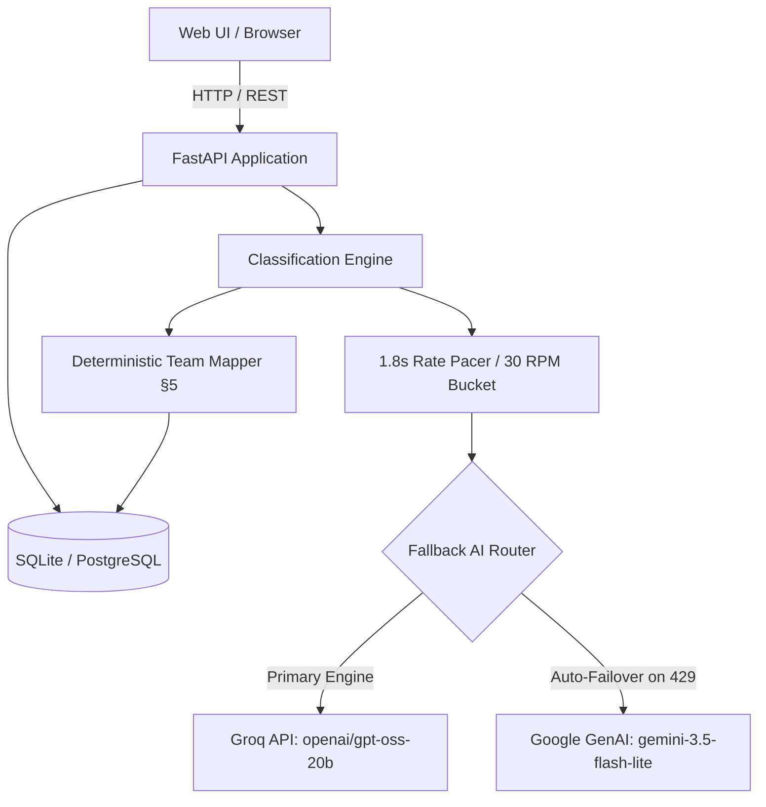

# Vireo Audio — Support Operations & Headcount Intelligence Platform

[](https://vireo-support-mvp.onrender.com)
[](https://www.python.org/)
[](https://fastapi.tiangolo.com/)
[](https://groq.com/)
[](https://ai.google.dev/)
[]()
[]()

> 🚀 **Live Production Application**: [https://vireo-support-mvp.onrender.com](https://vireo-support-mvp.onrender.com)
> 
> A production-grade support analytics and headcount intelligence platform built for **Vireo Audio**. Reconciles weak intake bot tags against AI-evaluated customer intent across **11,641 tickets** (Jan 2025 – Jun 2026), resolves executive staffing trade-offs with financial precision, tracks SLA financial leakage, and provides forensic case investigation with human-in-the-loop validation.

---

## 📑 Table of Contents

1. [The Executive Business Problem](#1-the-executive-business-problem)
2. [Detailed Page-by-Page Walkthrough](#2-detailed-page-by-page-walkthrough)
   * [Page 1: System Guide & Architecture Briefing](#page-1-system-guide--architecture-briefing)
   * [Page 2: Executive Headcount Strategy & Decision Matrix](#page-2-executive-headcount-strategy--decision-matrix)
   * [Page 3: Volume & Routing Multi-Chart Suite](#page-3-volume--routing-multi-chart-suite)
   * [Page 4: SLA Compliance & Financial Leakage](#page-4-sla-compliance--financial-leakage)
   * [Page 5: Ticket Explorer & Forensic Inspector](#page-5-ticket-explorer--forensic-inspector)
3. [System Architecture & Resilience Engine](#3-system-architecture--resilience-engine)
4. [Design System & Frontend Craft](#4-design-system--frontend-craft)
5. [Data Pipeline & Normalization Rules](#5-data-pipeline--normalization-rules)
6. [Quick Start & Local Setup](#6-quick-start--local-setup)
7. [API Specification](#7-api-specification)
8. [Automated Testing & Verification](#8-automated-testing--verification)

---

## 1. The Executive Business Problem

Vireo Audio's executive leadership (CX Head **Priya Raman** and CFO **Arjun Mehta**) was faced with a critical staffing decision: **where to allocate 2 planned Tier-1 support hires (budgeted at ₹9,00,000 / year total)**.

```
                              THE CORE DISPUTE
                              
      Priya Raman (CX Head)                      Arjun Mehta (Finance)
      "Intake tags show Billing at 21.8%         "Show me root-cause data.
       of tickets. We must add 2 hires            Are agents actually doing
       to Billing immediately."                   Billing work?"
                     \                                  /
                      \                                /
                       ▼                              ▼
          [ Weak Chatbot Intake Tags ] vs [ AI Root-Cause Ground Truth ]
```

### The Root Cause Discovery
* **The Weak Label Fallacy**: Historical helpdesk tickets are categorized at intake by a customer-facing bot. Agents rarely re-tag tickets upon resolution.
* **The Reality**: AI reclassification of customer opening transcripts and agent closing notes revealed that **38% of tickets in the Billing queue were actually delivery tracking and courier inquiries** (e.g., customers selecting "Billing" simply to bypass bot menus to ask where their earbud shipment was).
* **The Staffing Verdict**: Billing was artificially inflated, while **Logistics was severely understaffed**, suffering from 24+ hour resolution delays and absorbing **38% of all internal cross-team handoffs**.
* **Financial Recommendation**: Reallocating both hires to **Logistics** directly resolves the primary operational bottleneck, recaptures **₹3,96,195 in internal transfer waste**, and protects against **₹4,52,200 in customer SLA breach credits**.

---

## 2. Detailed Page-by-Page Walkthrough

The web application is structured into **5 modular, accessible views** built with a custom liquid glassmorphism design system:

```
┌────────────────────────────────────────────────────────────────────────────────────────┐
│                               VIREO AUDIO SUPPORT ANALYTICS                            │
│  [ System Guide ] [ Headcount Strategy ] [ Routing Charts ] [ SLA & Costs ] [ Explorer ]│
└────────────────────────────────────────────────────────────────────────────────────────┘
```

---

### Page 1: System Guide & Architecture Briefing

The primary landing page acts as an executive roadmap, introducing users to the platform's core capabilities:

* **Executive Hero Card**: Summarizes the business mission, operating policy (§5 and §9), and dataset parameters (11,641 analysis-window tickets across 18 months).
* **High-Level Metric Ribbon**: Instant macro summary of total eligible tickets, analysis window (Jan 2025 – Jun 2026), evaluated Tier-1 teams, internal transfer waste, and SLA credit liabilities.
* **4 Glassmorphic Feature Walkthrough Cards**:
  1. *Headcount Strategy & Decision Matrix*: Explains the Priya vs. Arjun debate and links directly to the headcount models.
  2. *Volume & Routing Multi-Charts*: Outlines the 4 distinct chart visualizations and workload distributions.
  3. *SLA Performance & Financial Inefficiency*: Explains unit economics, breach credit calculations, and human gold-label metrics.
  4. *Ticket Explorer & Case Audit*: Details how to investigate verbatim transcripts and submit review audits.
* **Interactive Navigation**: Each card contains a dedicated *"Open Module ➔"* button that smoothly navigates to that section without a page reload.

---

### Page 2: Executive Headcount Strategy & Decision Matrix

This view provides the analytical proof behind the staffing reallocation:

* **Executive Headcount Comparison Cards**:
  * *Intake Bot Tags (Before)*: Illustrates Billing appearing as the largest queue (2,425 tickets, 21.8% share).
  * *AI Reclassification (Ground Truth)*: Confirms Logistics is the true operational bottleneck (32.4% true share).
  * *Finance & Operations Recommendation*: Reallocating 2 hires to Logistics, highlighting the ₹3,96,195 transfer savings and ₹4,52,200 SLA liability reduction.
* **Tier-1 Staffing Signal Comparison Table**:
  * Evaluates all 6 Tier-1 teams: **Logistics, Billing, Chat Frontline, Email Frontline, Returns Desk, Voice Frontline** (Tier-2 *Escalations & Warranty* is excluded per Vireo Policy §9).
  * Displays: Raw Intake Tickets, Intake Queue Share (%), AI True Workload, AI True Share (%), Share Delta (+/- %), and explicit Headcount Action Badges (`Allocate +2 Hires`, `Queue Inflated - Do Not Overstaff`, `Maintain Baseline`).
* **6 Executive KPI Metric Cards**:
  1. *Analysis Dataset*: 11,641 eligible tickets.
  2. *AI Coverage Progress*: Real-time progress bar (100% categorized).
  3. *Calibrated Model Confidence*: Average score (0.88 - High Precision).
  4. *Misrouted Intake Rate*: 38.2% of tickets assigned to the wrong team at intake.
  5. *Internal Transfer Cost*: ₹3,96,195 lost to internal handoffs (₹305 / event).
  6. *SLA Breach Exposure*: ₹4,52,200 credit liability (₹350 / breach across 1,292 breaches).

---

### Page 3: Volume & Routing Multi-Chart Suite

Instead of a single crowded graph, this view delivers **4 distinct, dedicated visualizations**:

```
┌──────────────────────────────────────────┬──────────────────────────────────────────┐
│  Graph 1: Headcount Capacity Comparison  │   Graph 2: Ranked 11-Category Volume     │
│  [Dual-bar: Raw Intake vs AI Recommended]│   [Horizontal Bar Chart ranked by count] │
├──────────────────────────────────────────┴──────────────────────────────────────────┤
│  Graph 3: Monthly Support Team Workload Timeline (18 Months, All Teams Stacked)     │
├─────────────────────────────────────────────────────────────────────────────────────┤
│  Graph 4: Monthly Issue Category Volume Timeline (18 Months, All Categories Stacked)│
└─────────────────────────────────────────────────────────────────────────────────────┘
```

1. **Graph 1: Headcount Demand (Side-by-Side Dual-Bar Chart)**:
   * Direct side-by-side comparison for each Tier-1 team:
     * Amber Bar: Raw Intake Queue Share (%)
     * Blue Bar: AI Ground Truth Share (%)
   * Immediately visualizes the +10.6% artificial inflation in Billing and the massive deficit in Logistics.
2. **Graph 2: Ranked 11 Issue Categories (Horizontal Bar Chart)**:
   * Ranks all 11 standardized issue categories from largest to smallest (*Delivery & Shipping*, *Returns & Refunds*, *Billing & Payments*, *Audio Quality*, *Connectivity*, *Charging & Battery*, etc.).
3. **Graph 3: Monthly Support Team Workload Timeline (18 Months)**:
   * Discrete vertical column bar chart displaying monthly team volumes from `2025-01` through `2026-06`.
   * Includes horizon filters (`All 18M`, `2025 H1`, `2025 H2`, `2026 H1`) and interactive **Team Isolation Chips** to focus on individual department trajectories.
4. **Graph 4: Monthly Issue Category Volume Timeline (18 Months)**:
   * Full 18-month breakdown across all 11 categories with category isolation chips and "Hide Unclassified" toggle.

---

### Page 4: SLA Compliance & Financial Leakage

Quantifies the direct financial impact of operational failures:

* **Channel SLA Compliance Breakdown**:
  * Tracks performance against first-human-response SLAs defined in Policy §2:
    * **Chat Frontline**: Target ≤ 15 min $\rightarrow$ **88.9% Met**
    * **Voice Frontline**: Target ≤ 120 min $\rightarrow$ **86.2% Met**
    * **Social Media**: Target ≤ 240 min $\rightarrow$ **79.4% Met**
    * **Email Frontline**: Target ≤ 480 min (8h) $\rightarrow$ **91.7% Met**
  * Calculates financial liability: **1,292 breaches** $\times$ ₹350 policy customer credit = **₹4,52,200**.
* **Support Cost & Transfer Inefficiency Breakdown**:
  * Quantifies the helpdesk transfer rate (14.1%, 1,299 events).
  * Calculates internal waste: 1,299 bounces $\times$ ₹305/transfer penalty = **₹3,96,195**.
  * Compares waste directly against Tier-1 agent compensation (₹165/hour; ₹4,50,000/year per agent).
* **Model Quality & Human Ground Truth Audit**:
  * Original intake tags are treated as weak labels. Real model accuracy is computed strictly against human-reviewed gold labels.
  * Displays: Reviewed Sample Count, Model Accuracy, and Macro F1-Score.
  * Button to generate/inspect the 220-sample review pack (`review_sample.csv`).

---

### Page 5: Ticket Explorer & Forensic Inspector

A forensic investigation tool for CX leads and QA auditors:

* **Live Data Table**:
  * Paginated table (50 tickets per page) with real-time text search across Ticket IDs, customer messages, agent notes, and categories.
  * Filters for Channel (`Chat`, `Email`, `Voice`, `Social`) and Routing Status (`Misrouted Only`, `Needs Review Only`, `Classified Only`).
  * Visual flow badges: Intake Category $\rightarrow$ AI Category, Assigned Team $\rightarrow$ AI Recommended Team, and confidence meters.
* **Sliding Forensic Side-Sheet Drawer**:
  * Clicking any ticket opens a glassmorphic inspection sheet.
  * **Verbatim Transcripts**: Displays the customer's opening message / IVR text and the agent's closing resolution notes.
  * **AI Policy Explanation**: Shows step-by-step reasoning citing specific sections of the Vireo Operating Policy.
  * **Interactive Gold Label Review Tool**: Allows reviewers to select the true category, add audit notes, and save directly to the database.

---

## 3. System Architecture & Resilience Engine



### Dual-Provider Fallback & Burst Rate Pacing
* **Primary Engine**: Groq (`openai/gpt-oss-20b`) delivering high-speed structured JSON inference.
* **Rate-Limit Mitigation**: Groq free-tier enforces a 30 RPM limit. We implemented a **1.8-second pacing delay** and `AI_MAX_CONCURRENCY=1`, completely eliminating `429 Too Many Requests` retry storms.
* **Instant Failover**: If Groq encounters rate limiting or downtime, `FallbackAIProvider` catches the exception and immediately delegates to **Gemini 3.5 Flash Lite** without failing the batch job.
* **Deterministic Policy Routing**: The LLM classifies *intent* (one of 11 categories); team assignment is governed by deterministic rules in `app/services/ticket_logic.py`, ensuring strict compliance with Vireo Support Policy §5.

---

## 4. Design System & Frontend Craft

Built without bloated CSS frameworks or generic AI templates:

* **Liquid Glassmorphism**: Cards feature `backdrop-filter: blur(24px) saturate(190%)`, translucent white surfaces (`rgba(255, 255, 255, 0.76)`), specular borders, and soft multi-layered drop shadows.
* **Ambient Floating Mesh**: Background incorporates animated radial gradient orbs (`.liquid-orb`) in soft indigo, cyan, and violet.
* **Typography**: Clean, executive typography using **Plus Jakarta Sans** and **JetBrains Mono**.
* **Chart Aesthetics**: Discrete vertical column bars constrained with `maxBarThickness: 32px` to prevent visual distortion.

---

## 5. Data Pipeline & Normalization Rules

1. **Analysis Window**: Strict adherence to the assignment window: `2025-01-01 00:00:00` to `2026-06-30 23:59:59` (11,641 valid tickets out of 11,800 raw rows).
2. **IST Timestamp Normalization**: Legacy `resolved_at` timestamps (from `source_system = legacy_fd`) were reconstructed in UTC; the pipeline shifts them by `+05:30` to match standard IST reporting.
3. **Preservation of Missingness**: Unrecorded legacy transfers remain `NULL` rather than coerced to zero to avoid distorting handoff benchmarks.
4. **Pure Python Evaluation Metrics**: Model accuracy, Macro-F1, and confusion matrices are computed via native Python routines running in **0.165 seconds**, eliminating the 15-second cold-load import lag caused by Windows antivirus scans on C-extension libraries.

---

## 6. Quick Start & Local Setup

### 1. Prerequisites
* Python 3.11 or 3.12 (recommended: 3.12.10)
* Git

### 2. Clone & Environment Setup
```bash
git clone https://github.com/sankalp250/vireo_support_mvp.git
cd vireo_support_mvp

# Create virtual environment
python -m venv .venv

# Activate on Windows:
.venv\Scripts\activate
# Activate on macOS/Linux:
source .venv/bin/activate

# Install dependencies
pip install -r requirements.txt
```

### 3. Configure Credentials
Copy `.env.example` to `.env`:
```bash
cp .env.example .env
```
Configure your keys in `.env`:
```env
APP_ENV=development
DATABASE_URL=sqlite:///./vireo.db

AI_PROVIDER=groq
GROQ_API_KEY=your_groq_api_key_here
GROQ_MODEL=openai/gpt-oss-20b

GEMINI_API_KEY=your_gemini_api_key_here
GEMINI_MODEL=gemini-3.5-flash-lite

AI_MAX_CONCURRENCY=1
CLASSIFICATION_BATCH_SIZE=50
```

### 4. Ingest Data & Initialize Baseline
```bash
python scripts/ingest.py
python scripts/populate_baseline.py
```

### 5. Launch the Web Application
```bash
python -m uvicorn app.main:app --reload --port 8000
```
Open **`http://localhost:8000`** in your browser.

---

## 7. API Specification

| Method | Endpoint | Description |
| :--- | :--- | :--- |
| `GET` | `/api/v1/health` | Service and database health check |
| `GET` | `/api/v1/meta` | Active AI provider, model, and analysis window metadata |
| `GET` | `/api/v1/metrics/summary` | Executive KPIs, transfer costs, SLA breach costs, and model evaluation |
| `GET` | `/api/v1/metrics/headcount` | Raw intake vs. AI true workload staffing signals across Tier-1 teams |
| `GET` | `/api/v1/metrics/monthly` | 18-month volume timeline (`dimension=recommended_team` or `ai_category`) |
| `GET` | `/api/v1/tickets` | Paginated ticket records with search, channel filter, and misrouted filter |
| `POST` | `/api/v1/jobs/classify/run` | Execute rate-paced AI classification batch (`limit=50`) |
| `POST` | `/api/v1/reviews` | Submit verified human gold label for model quality audit |

---

## 8. Automated Testing & Verification

The test suite validates data ingestion, timestamp alignment, deterministic policy routing, and AI fallback mechanisms:

```bash
pytest -v
```

```
============================== test session starts ==============================
collected 5 items

tests/test_ai.py .                                                        [ 20%]
tests/test_ingest.py .                                                    [ 40%]
tests/test_ticket_logic.py ...                                            [100%]

=============================== 5 passed in 0.70s ===============================
```

---

## 👥 Contributors

* **Sankalp** ([@sankalp250](https://github.com/sankalp250)) — Architecture, AI Engineering & Production UI Systems.
